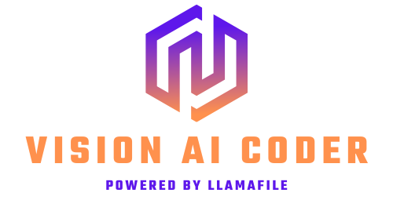
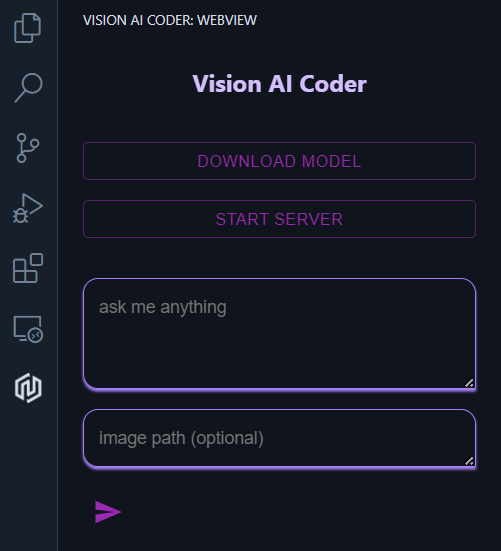
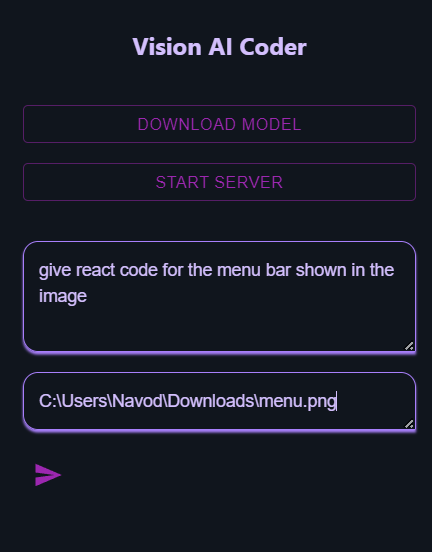

  

    
    
    
    
    
    
    

#### Vision AI Coder 

Vision AI Coder is a vscode extension that allow developers to download and run a local vision AI model. It provide a Chat Interface for developers to ask any question. Developers can also use images to provide more context to there questions.

this extension uses llamafile for running GGUF formated models which are fast and supports more consumer grade hardware.

you can run inference on a cpu with only 8gb of ram.

#### How to Use:

1. Click on the extension icon
2. Click download model button (around 5gb will be downloaded)
3. Click start server button
4. you can ask any question and optionally can provide an image

Note: provide absolute filepath for image and filepath should not contain spaces

  

  

#### Models Used:

1. https://huggingface.co/xtuner/llava-phi-3-mini-gguf

#### Contributions

contributors are always welcome. let's build together!